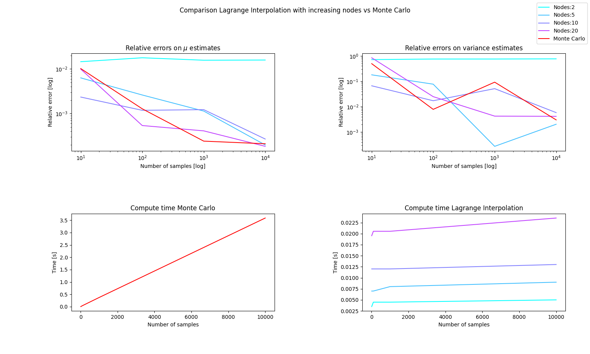
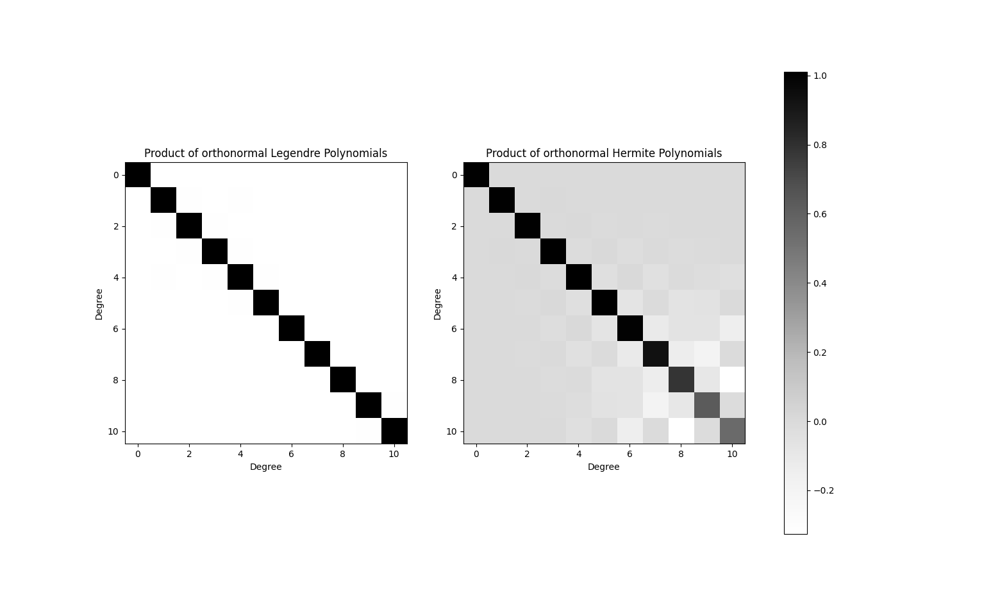
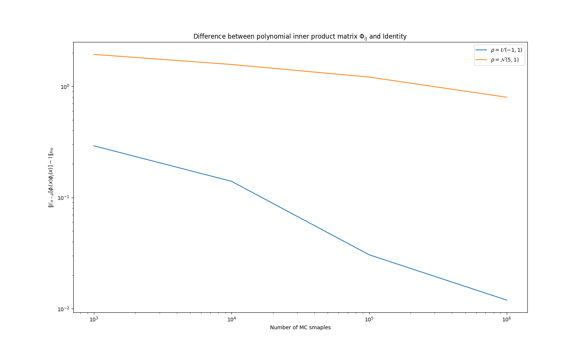
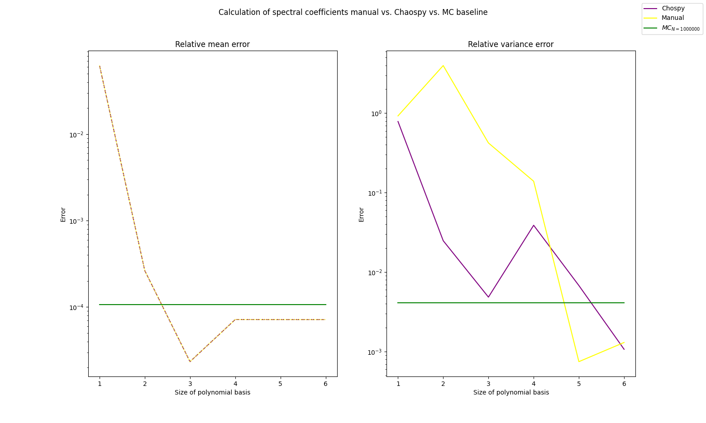

### Assignment 1:
To obtain the Lagrange Interpolation as a surrogate function, one first has to create the grid $G = (x_i)_{i=0}^N$  either by uniformly generating points within the given `omega_bounds` or, being more precise, by applying the given rule of calculation for Chebyshev nodes.

The next step is then to generate a Lagrangian basis of size $|G|$, wr.t. the given grid. 

Finally we have to fit the Lagrangian basis to the function we wish to approximate. In our case, with a fixed point in time, we have $f(t,\omega) \overset{t = 10} = f_{t=10}(\omega)$, which we evaluate at the given (Chebyshev) nodes and then express as an element of the vector space of our Lagrangian basis $I_N^Gf_{t=10}(\omega) \approx \sum_{i=0}^Nf_{t=10}(\omega_i) \cdot \mathcal L(\omega_i)$.

Sampling from the surrogate function, a polynomial, is much more time efficient than approximating solutions for the true underlying ODE, yet it is still possible to approximate the QoI for $f_{t=10}(\omega)$ quite precisly. This is shown in Fig.1 

(Fig.1)

Clearly visible is that performing MC on the surrogate polynomial achieves similar relative errors to the ground truth, especially with increasing nodes in the Grid, i.e. larger $N$.
Another important aspect of Fig. 1 is that compute time for Monte Carlo on the ODE is much greater and scales more drastically compared to the polynomial surrogate, which scales very well with number of samples but takes longer for larger $N$. 

Timing observations can of course only be reported with the usual dependence on the underlying hardware, the caching behavior  etc.

### Assignment 2

#### Part 2.1

We have orthogonality condition, to be shown, defined as: $$\langle\phi_i(x),\phi_j(x)\rangle_\rho\overset{!}=\gamma_i\delta_{ij} $$
with the inner product in function space:$$\langle\phi_i(x),\phi_j(x)\rangle_\rho := \int_{\mathbb D_\phi}\phi_i(x)\phi_j(x)\rho(x)dx$$
also the definition for the expected value over a continuous RV x as: $$\mathbb E_{X \sim \mathcal D}[X] = \int_\text{span(X)} p_\mathcal D(x)\cdot x\ dx$$
It follows by unconscious statistician that:
$$\mathbb E_X[\phi_i(X)\cdot \phi_j(X)] = \int_\text{span(X)}\phi_i(x)\phi_j(x)p_\mathcal D(x)\ dx$$
Because $\phi_i(x)\phi_j(x)p_\mathcal D(x) = 0$ if $x\ne span(x)$ by definition of the span, so the above term can be written as:
$$\int_\text{span(X)}\phi_i(x)\phi_j(x)p_\mathcal D(x)\ dx = \int_\mathbb {D_\phi}\phi_i(x)\phi_j(x)p_\mathcal D(x)\ dx$$

Looking at the definition of the inner product we write:
$$\int_\mathbb {D_\phi}\phi_i(x)\phi_j(x)p_\mathcal D(x)\ dx = \langle\phi_i(x),\phi_j(x)\rangle_{p_\mathcal D}$$ Hence the above orthogonality condition is equivalent to:
$$\mathbb E_X[\phi_i(X)\cdot \phi_j(X)] = \gamma_i\delta_{ij}$$
, with the additional requirement of $\gamma_i \overset ! =  1 \forall i$ for orthonormality.

#### Part 2.2

We generate hermite / Legendre polys depending on the given distribution of $\omega$. We transform any obtain orthogonality w.r.t. any Normal or Uniform distribution by generating a standard hermite poly $\phi_H(x)$ and transforming it to $\phi_H'(\frac{x-\mu}{\sigma^2})$ or a standard legendre $\phi_L(x)$ and transforming it to $\phi_L'(2\frac{x-a}{b-a} -1)$ for $x\sim \mathcal U(a,b)$.

We perform MC to calcuate the above derived expected value forall ij.

We get to see Fig. 2

(Fig. 2)

which shows $\mathbb E_{ij}$ approximates the identity matrix.
We also observe more off-diagonal noise for the Hermite / Normal distribution $\rho_2$

Looking at Fig. 3:

(Fig.3)

Shows a steadily decreasing Fro-distance between Identity and $\mathbb E_{ij}$ with slower decrease in $\rho_2$

### Assignment 3

We have $f^N(t,\omega) = \sum_{i=0}^{N-1} \hat f_i(t) \phi_i(\omega)$. Taking the inner product with the first polynomial $\phi_0$ of the polynomial sequence in which $\phi_i$ occurs, gives (because of linearity of inner products):
$$\langle f^N(t,\omega), \phi_0(\omega)\rangle_\rho = \sum_{i=0}^{N-1}\hat f_i(t)\langle \phi_i(\omega),\phi_0(\omega)\rangle_\rho$$
Because the sequence of $\phi(x)$ is constructed to be orthogonal or w.l.o.g. orthonormal  i.e. $\langle \phi_i(x)\phi_j(x)\rangle_\rho = \delta_{ij}$ we obtain:
$$\langle f^N(t,\omega), \phi_0(\omega)\rangle_\rho = \sum_{i=0}^{N-1}\hat f_i(t)\delta_{i0}$$
. Omitting summation terms for which $\delta_{i0} = 0$, so everything except $i = 0$, leaves
$$\langle f^N(t,\omega), \phi_0(\omega)\rangle\rho = \hat f_0(t)$$
Finally substituting in on the LHS, the definition of the inner product on function spaces and then the definition of the first orthonormal polynomial (which has to be $\phi_0(x) = 1$ b/c $\langle \phi_0,\phi_0 \rangle \overset ! = 1$):
$$\mathbb E_{\omega \sim \rho}[f^N(t,\omega)] = \hat f_0(t)$$

concludes the first derivation.

Now $Var(x) = \mathbb E[x^2] - E[x]^2$ or applied to $f^N$:
$$Var[f^N(t,\omega)] = \mathbb E[f^N(t,\omega)^2] - \mathbb E[f^N(t,\omega)]^2$$
As $\mathbb E[f^N(t,\omega)] = \hat f_0(t)$:
$$Var[f^N(t,\omega)] = \mathbb E[f^N(t,\omega)^2] - \hat f_0(t)$$
Replacing $f^N$ with its spectral, polynomial approximation and considering $\mathbb E[\cdot]$ is linear:
$$Var[f^N(t,\omega)] = \mathbb \sum_{i=0}^N\hat f_i(t)^2\cdot \mathbb E[\phi_i(\omega)] - \hat f_0(t)$$
, where $\hat f_i(t)$ is deterministic / constant w.r.t. $\omega$. Now the expectation $\mathbb E_\omega[\phi_i(\omega)] = 1 \forall i$ as $\phi_i$ has to be orthogonal or again w.l.o.g. orthonormal to $\phi_0 = 1$.
Therefore we can just leave it out:
$$Var[f^N(t,\omega)] = \mathbb \sum_{i=0}^N\hat f_i(t)^2 - \hat f_0(t)$$
Or just adjusting the index of the sum:
$$Var[f^N(t,\omega)] = \mathbb \sum_{i=1}^N\hat f_i(t)^2$$
, completing the second derivation.
### Assignment 4

We can calculate nodes and weights for quadrature with Chaospy.
Coefficients are then just a dot product $c_j = \sum_i f(x_i)\cdot \phi_j(x_i)) \cdot w_i$, ($x_i$ are the quadrature nodes and $w_i$ the weights).

Alternatively Chaospy's `fit_quadrature` with `retall=1`does the trick.
Going by the previous derivations we can easily obtain mean and variance. Plotting them one can see in Fig.4, that 1: calculations for the mean are identical, 2: Variance differs, but achieves similar results for higher degrees of the orthogonal poly basis. 

Ofc for higher polynomial degrees the approximation gets better and the relative error drops.

The comparison to the MC baseline shows that PCE can achieve similar or even better errors. Although not plotted the PCE calculation achieves this result in much quicker time than MC on the ODE.
